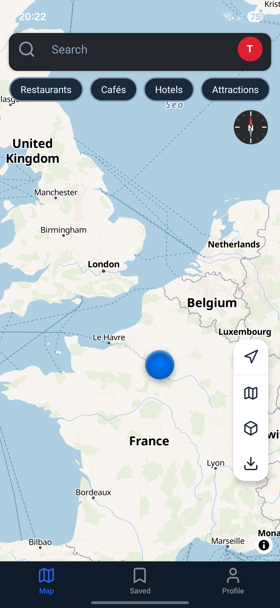
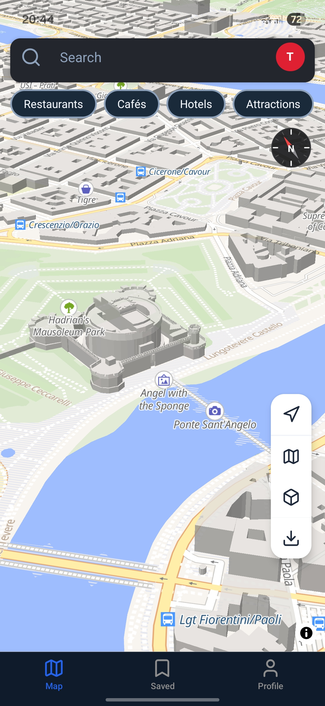
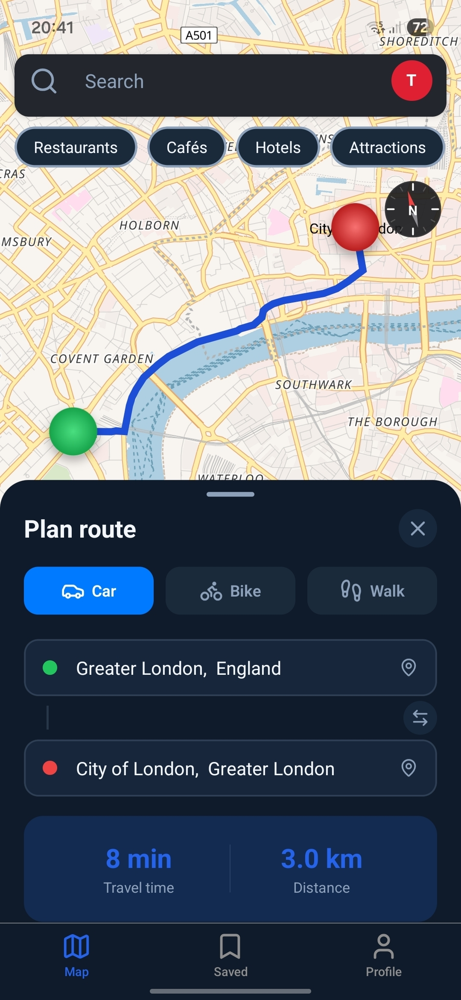
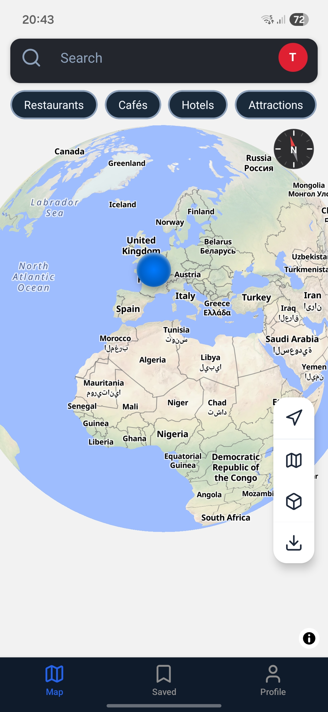

<div align="center">


# Atlasys

**The map app that doesn't track you.**

[](https://github.com/Cactus-Apps/Atlasys/releases)
[]()
[](LICENSE.md)
[](https://atlasys.vercel.app)
[](https://www.instagram.com/atlasys.app)

</div>

---

## What is Atlasys?

Atlasys is a privacy-first, open-source map application built with React Native and Expo. It gives you offline maps, 3D cities, smart routing, and point-of-interest discovery — without selling your data, showing you ads, or tracking your movements.

Map data comes from [OpenStreetMap](https://openstreetmap.org) under the ODbL license. Routing is powered by [OSRM](https://routing.openstreetmap.de). No proprietary map APIs. No hidden trackers.

> [!IMPORTANT]
> The Android APK releases on **June 1, 2026**. iOS support is planned shortly after.

---

## Screenshots

<!-- Add your screenshots here -->

| Map                                                        | 3D View                                                       | Routing                                                          | Globe                                                            |
| ---------------------------------------------------------- | ------------------------------------------------------------- | ---------------------------------------------------------------- | ---------------------------------------------------------------- |
|  |  |  |  |

---

## Features

- **Zero Tracking** — No location data sold. No ads. No behavioral profiles.
- **Offline Maps** — Download regions before you travel. Navigate without internet.
- **3D Globe & Buildings** — Explore cities in immersive 3D with tilt support.
- **Smart Routing** — Car, bike, and walking routes via OSRM.
- **POI Filtering** — Filter Restaurants, Cafés, Hotels, Bars, and more directly on the map.
- **Wikipedia Integration** — Tap any city for info, photos, and articles.
- **Saved Places** — Save locations and access them offline.
- **Beautiful Themes** — Standard, Dark, Midnight, Ocean, Forest, and more.
- **GDPR Compliant** — Built with European privacy standards from day one.
- **100% Open Source** — Read every line of code on GitHub.

---

## Installation (Android)

1. Go to [Releases](https://github.com/Cactus-Apps/Atlasys/releases) and download the latest `.apk` file.
2. Open the file in your file manager.
3. If prompted about installing from an unknown source, tap **Allow**.
4. Tap **Install**.

> [!NOTE]
> Apple App Store support is planned. iOS is not yet available.

---

## Getting Started (Development)

### Prerequisites

- Node.js 18 or later
- Expo CLI (`npm install -g expo-cli`)
- Android Studio or Xcode

### Setup

```bash
git clone https://github.com/Cactus-Apps/Atlasys.git
cd Atlasys
npm install
cp .env.example .env.local   # fill in your keys
npx expo start
```

See [CONTRIBUTING.md](CONTRIBUTING.md) for the full development guide.

---

## Contributing

Contributions are very welcome — especially in these areas:

- **UI / UX improvements** — better flows, cleaner layouts, accessibility
- **Translations** — new languages via the `i18n/` folder
- **Bug fixes** — pick an open issue and send a PR
- **Map data** — editing [OpenStreetMap](https://openstreetmap.org) directly benefits Atlasys and every OSM-based app

If you have an idea or found a bug, open an [Issue](https://github.com/Cactus-Apps/Atlasys/issues).
For security vulnerabilities, please email **cactus_apps@proton.me** instead of opening a public issue.

→ Read the full [CONTRIBUTING.md](CONTRIBUTING.md)

---

## Tech Stack

| Layer           | Technology                                |
| --------------- | ----------------------------------------- |
| Framework       | React Native + Expo                       |
| Maps            | react-native-maplibre-gl-js + OpenFreeMap |
| Routing         | OSRM (routing.openstreetmap.de)           |
| Auth & DB       | Supabase                                  |
| Offline Maps    | expo-sqlite + custom MBTiles              |
| State           | Zustand                                   |
| Crash Reporting | Sentry                                    |
| Analytics       | PostHog (opt-in)                          |

---

## Privacy

Atlasys collects as little data as possible. Your GPS location stays on your device. We do not sell data, show ads, or build profiles about you.

→ Read the full [Privacy Policy](https://atlasys.vercel.app/privacy)

---

## Links

- Website: [atlasys.vercel.app](https://atlasys.vercel.app)
- Instagram: [@atlasys.app](https://www.instagram.com/atlasys.app)
- Contact: [cactus_apps@proton.me](mailto:cactus_apps@proton.me)

---

### License

This project is licensed under the **GNU General Public License v3.0 (GPLv3)**.

Everyone is free to use, modify, and distribute the code — but any derivative work must also be released under GPLv3.

## See [LICENSE.md](LICENSE.md) for the full license text.

<div align="center">
  <sub>Made with ❤️ by <a href="https://github.com/Cactus-Apps">Cactus Apps</a></sub>
</div>
