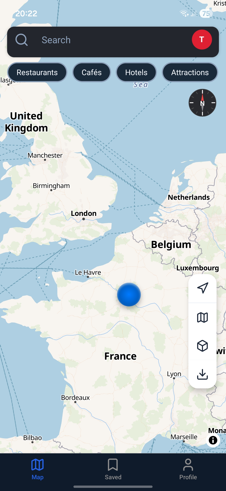
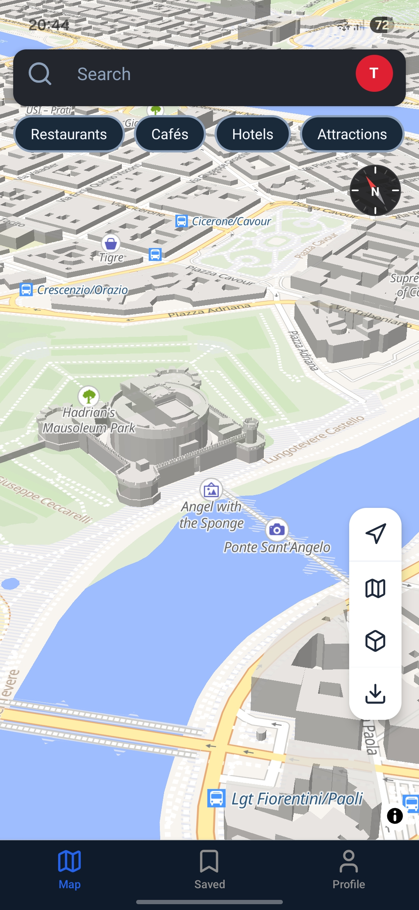
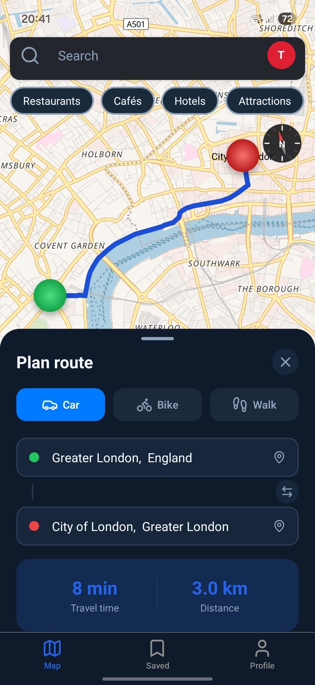
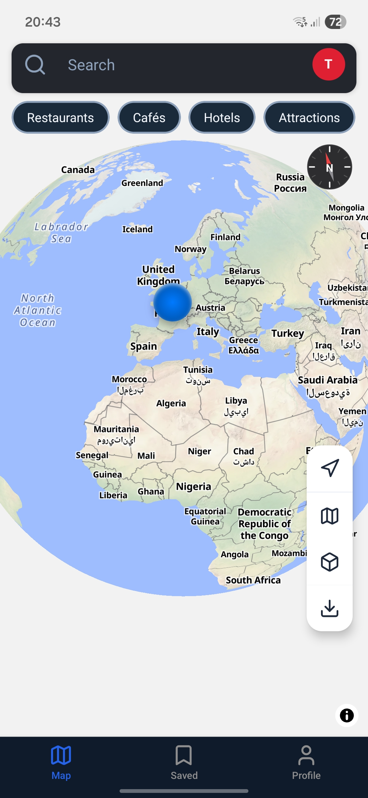

<div align="center">


# Atlasys

**The map app that doesn't track you.**

[](https://github.com/Cactus-Apps/Atlasys/releases)
[](https://github.com/Cactus-Apps/Atlasys/releases)
[](LICENSE)
[](https://atlasys.vercel.app)

</div>

---

## What is Atlasys?

Atlasys is a privacy-first, open-source map app that gives you offline maps, 3D cities, smart routing and live location sharing — without ads, trackers, or anyone selling your data. Save your favourite places, plan multi-stop trips and share your exact position with friends and family end-to-end encrypted and fully GDPR compliant.

Map data comes from [OpenStreetMap](https://openstreetmap.org) under the ODbL license. Routing is powered by [OSRM](https://routing.openstreetmap.de). No proprietary map APIs. No hidden trackers.

---

## Screenshots

| Map                                                      | 3D View                                                     | Routing                                                        | Globe                                                          |
| -------------------------------------------------------- | ----------------------------------------------------------- | -------------------------------------------------------------- | -------------------------------------------------------------- |
|  |  |  |  |

---

## Features

- **📍 Location sharing** — Share your live position with friends and family, end-to-end encrypted. Pair via QR code, protect the view with biometrics, and cut off access at any time.
- **🗺️ Multi-stop route planning** — Plan routes with as many stops as you like, by car, bike or on foot, with turn-by-turn directions and spoken instructions.
- **⭐ Saved Places** — Save places, POIs and your own custom pins, back them up to a file and access them offline.
- **🛡️ Zero tracking** — No location data sold. No ads. No behavioral profiles.
- **📶 Offline maps** — Download a region before you travel and browse the map without a connection.
- **🌍 3D globe & buildings** — Explore cities in immersive 3D, tilt the map or zoom out to the whole planet.
- **🍽️ POI filtering** — Find restaurants, cafés, hotels, bars and more right on the map.
- **📖 Wikipedia integration** — Tap any city for info, photos and articles.
- **🌦️ Weather** — Current conditions and a 7-day forecast for wherever you are.
- **🎨 Beautiful themes** — Light, Dark, Modern, Chill, Midnight, Ocean and Forest, plus three tab bar styles.
- **🌐 3 languages** — English, German and Spanish.
- **🔒 GDPR compliant** — Built with European privacy standards from day one.
- **💻 100% open source** — Read every line of code on GitHub.

---

## Installation

### Android

1. Go to [Releases](https://github.com/Cactus-Apps/Atlasys/releases) and download the latest `.apk` file.
2. Open the file in your file manager.
3. If prompted about installing from an unknown source, tap **Allow**.
4. Tap **Install**.

### iOS

Not available yet.

---

## Getting Started (Development)

### Prerequisites

- Node.js 18 or later
- Expo CLI (`npm install -g expo-cli`)
- Android Studio or Xcode

### Setup

```bash
git clone https://github.com/Cactus-Apps/Atlasys.git
cd Atlasys
npm install
cp .env.example .env.local
npx expo start
```

See [CONTRIBUTING.md](CONTRIBUTING.md) for the full development guide.

---

## Contributing

Contributions are very welcome — especially in these areas:

- **UI / UX improvements** — better flows, cleaner layouts, accessibility
- **Translations** — new languages via the `locales/` folder (currently English, German, Spanish)
- **Bug fixes** — pick an open issue and send a PR
- **Map data** — editing [OpenStreetMap](https://openstreetmap.org) directly benefits Atlasys and every OSM-based app

If you have an idea or found a bug, open an [Issue](https://github.com/Cactus-Apps/Atlasys/issues).
For security vulnerabilities, please email **cactus_apps@proton.me** instead of opening a public issue.

→ Read the full [CONTRIBUTING.md](CONTRIBUTING.md)

---

## Tech Stack

| Layer             | Technology                                |
| ----------------- | ----------------------------------------- |
| Framework         | React Native + Expo                       |
| Navigation        | expo-router (file-based)                  |
| Maps              | MapLibre + OpenFreeMap / bundled styles   |
| Routing           | OSRM (routing.openstreetmap.de)           |
| Live sharing      | Supabase Realtime + NaCl encryption       |
| Auth & sync       | Supabase (email, Google, hCaptcha)        |
| Offline maps      | expo-sqlite + custom MBTiles              |
| Offline storage   | AsyncStorage + expo-secure-store          |
| Animations        | react-native-reanimated + gesture-handler |
| State             | Zustand                                   |
| Crash reporting   | Sentry (opt-out)                          |
| Analytics         | PostHog (opt-in)                          |
| Navigation voices | react-native-tts                          |
| Translations      | i18next (en, de, es)                      |

---

## Privacy

Atlasys collects as little data as possible. Your GPS location stays on your device — including when you share it, since sharing sessions are end-to-end encrypted. We do not sell data, show ads, or build profiles about you.

→ Read the full [Privacy Policy](https://atlasys.vercel.app/privacy)

---

## Links

- Website: [atlasys.vercel.app](https://atlasys.vercel.app)
- Contact: [cactus_apps@proton.me](mailto:cactus_apps@proton.me)

---

## License

This project is licensed under the **GNU General Public License v3.0 (GPLv3)**.

Everyone is free to use, modify, and distribute the code — but any derivative work must also be released under GPLv3.

See [LICENSE](LICENSE) for the full license text.

<div align="center">
  <sub>Made with ❤️ by <a href="https://github.com/Cactus-Apps">Cactus Apps</a></sub>
</div>
